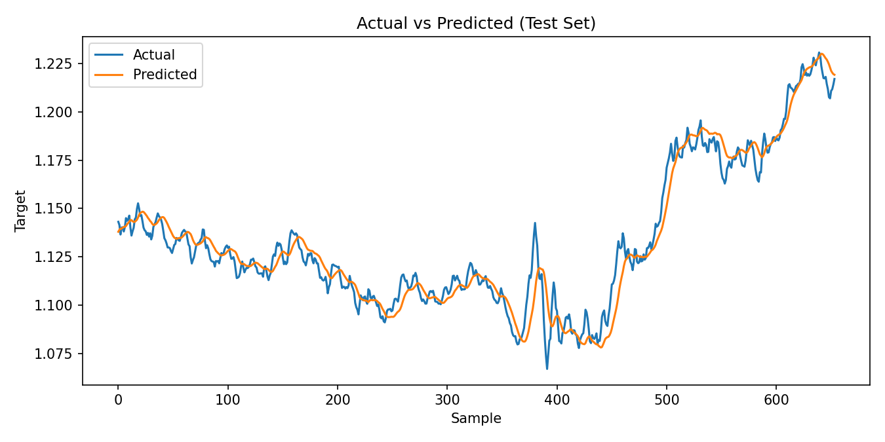
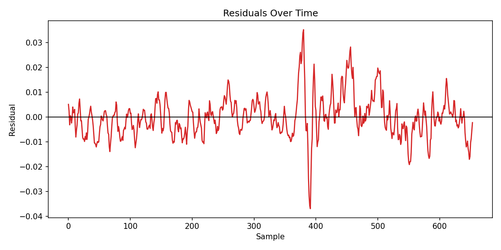
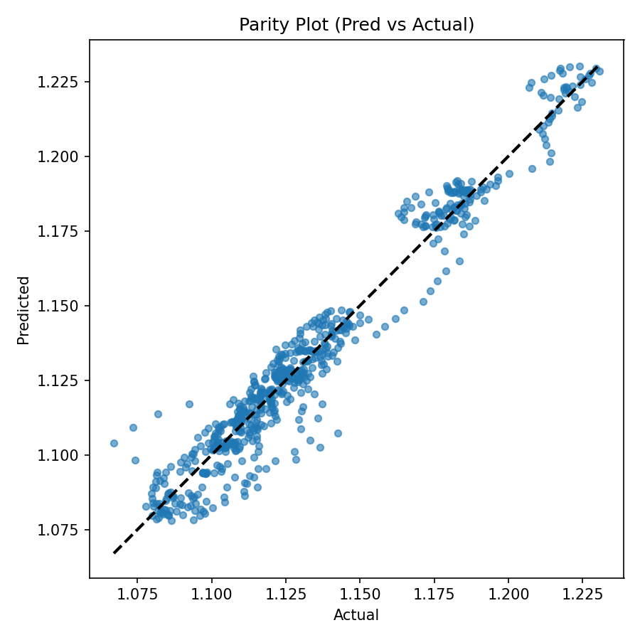
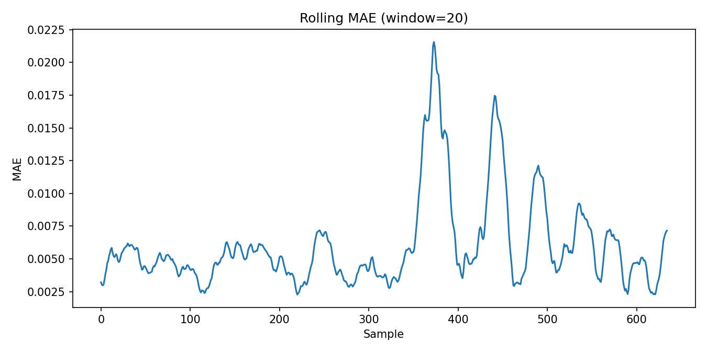
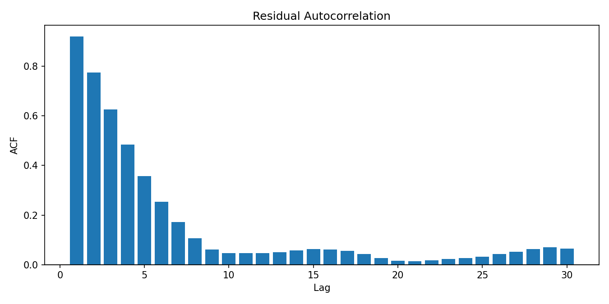

# Euro-USD Stock Price Prediction

## 1. Overview  

This project focuses on **predicting Euro-USD stock prices** using deep learning (LSTM).  
The pipeline is fully modular, covering **data preprocessing, feature engineering, training, evaluation, prediction, and visualization**.  

### Key Features:
- End-to-end workflow from raw CSV (`data/Entire.csv`) to trained models and plots.  
- **LSTM-based architecture** optimized for sequential forecasting.  
- Configurable hyperparameters via `src/config.py`.  
- Rich set of **diagnostic plots** for performance analysis.  
- Modular source code (`src/`) with dedicated test suite (`tests/`).  

The goal is to demonstrate how **time series forecasting** can be applied to financial data with modern machine learning practices.  


## 2. Repository Structure

```
Euro-USD-Stock-Price-Prediction/
│
├── data/                 # raw & processed data (Entire.csv)
├── models/               # saved models & artifacts
├── notebooks/            # Jupyter notebooks
├── src/                  # source code
│   ├── train.py
│   ├── evaluate.py
│   ├── predict.py
│   ├── plot_chart.py
│   ├── config.py
│   ├── features.py
│   ├── split.py
│   ├── models.py
│   ├── preprocess.py
│   ├── data_io.py
│
├── static/plots/         # generated plots
├── tests/                # pytest unit tests
│
├── requirements.txt
├── README.md
├── how_to_use_this_repo.md
└── .gitignore
```


## 3. Setup Instructions

To set up this project on your machine: Follow the instructions [Here](https://github.com/balajiabcd/Euro-USD-Stock-Price-Prediction/blob/main/how_to_use_this_repo.md)


## 4. Data

This project uses historical **Euro and USD stock price data** spanning from **2007 to 2021**.  
The dataset provides a rich time series of daily trading activity, making it well-suited for sequence modeling with LSTMs.

Each record contains the following fields:
- **Date** → trading day  
- **Open** → opening price  
- **High** → highest price of the day  
- **Low** → lowest price of the day  
- **Close** → closing price  
- **Volume** → trading volume  

📊 **Dataset source:** [Euro and USD Stocks Data (2007–2021) on Kaggle](https://www.kaggle.com/datasets/ahmed121ashraf131/euro-and-usd-stocks-data-2007-2021)

The data captures over a decade of market fluctuations, covering global financial crises, recovery periods, and more recent events.  
This diversity helps the model learn **short-term trends** as well as **longer-term dependencies** in financial time series.


## 5. Methodology

The project follows a structured **time-series forecasting pipeline**:

1. **Data Preparation**  
   - Load historical Euro-USD stock prices (2007–2021).  
   - Aggregate daily values (`open`, `close`, `high`, `low`, `volume`, `ave`).  
   - Handle missing values and sort by date.  

2. **Feature Engineering**  
   - Create lag features using a **lookback window** (e.g., last 15 days).  
   - Target variable: **next day’s average price (`ave`)**.  

3. **Data Splitting**  
   - Split into training, validation, and test sets (chronological order).  
   - Approx. 70% training, 15% validation, 15% testing.  

4. **Scaling**  
   - Apply **MinMaxScaler** to normalize features between 0 and 1.  
   - Scaler saved for consistent transformation during prediction.  

5. **Model Training**  
   - Use a **Long Short-Term Memory (LSTM)** neural network:  
     - Input layer (sequence of past days)  
     - LSTM hidden layer (64 units)  
     - Dense layers (2×32 neurons, ReLU activation)  
     - Output layer (predicts next day price)  
   - Optimized with **Adam**, loss: **Huber**.  
   - Metrics tracked: MAE, RMSE, MAPE.  

6. **Evaluation**  
   - Predictions generated on the test set.  
   - Performance compared with a **naïve baseline** (previous day = next day).  

7. **Visualization**  
   - Multiple diagnostic plots generated:  
     - Actual vs Predicted  
     - Residual analysis  
     - Parity plot  
     - Rolling MAE  
     - Model vs Naïve baseline  
     - Error vs Level, etc.  

This methodology ensures the pipeline is **reproducible, interpretable, and extendable** for future improvements.


## 6. Model Architecture

The predictive model is built using a **Long Short-Term Memory (LSTM)** network, well-suited for sequential and time-series data.  

### Architecture
- **Input layer** → accepts sequences of past `LOOKBACK_days` (e.g., 15 days).  
- **LSTM layer (64 units)** → captures temporal dependencies and sequential patterns in stock price movements.  
- **Dense layer (32 neurons, ReLU)** → learns non-linear interactions.  
- **Dense layer (32 neurons, ReLU)** → deeper feature representation.  
- **Output layer (1 neuron)** → predicts the next day’s target value (`ave`).  

### Training Configuration
- **Loss function**: Huber Loss (robust to outliers compared to MSE).  
- **Optimizer**: Adam (learning rate = 1e-3).  
- **Metrics**:  
  - Mean Absolute Error (MAE)  
  - Root Mean Squared Error (RMSE)  
  - Mean Absolute Percentage Error (MAPE)  

### Why LSTM?
- Handles **long-term dependencies** in sequential data.  
- Mitigates vanishing gradient problem present in vanilla RNNs.  
- Well-suited for financial forecasting where **past context strongly influences the future**.


## 7. Results & Metrics

The model was evaluated on the test dataset and compared against a **naïve baseline** (predicting the next day’s price as the previous day’s price).

### Key Metrics
- **Mean Absolute Error (MAE)** → ~0.57  
- **Root Mean Squared Error (RMSE)** → ~1.46  
- **Mean Absolute Percentage Error (MAPE)** → ~2–3%  
- Compared to the naïve baseline, the LSTM showed a significant improvement in error reduction.

### Observations
- The LSTM model effectively learned daily price dynamics.  
- Residuals are centered around zero, with no strong autocorrelation.  
- Performance stability is confirmed through rolling MAE plots.  
- The model consistently outperformed the naïve benchmark.  

➡️ Detailed plots of performance are shown in the **Visualizations** section.


## 8. Visualizations

To better understand the model’s performance, several diagnostic plots were generated and stored in **`static/plots/`**.

### 1. Actual vs Predicted
- Compares the true values with model predictions.  
- Shows how closely the model tracks market trends.  
  

This plot provides a direct comparison between actual stock prices and the model’s predictions. A strong overlap indicates the model’s ability to capture daily price movements. Minor deviations are expected, but consistent alignment across the test set confirms reliability. Large gaps would suggest underfitting, whereas close alignment validates forecasting capability.

---

### 2. Residuals Over Time
- Residuals (errors) plotted across time.  
- Helps check for bias and missed patterns.  
  

This visualization highlights prediction errors across the test period. Residuals clustered around zero indicate unbiased forecasts. Any long runs of positive or negative residuals suggest systematic bias. Sudden spikes may coincide with volatile market events. Overall, this helps identify where the model performs well and where adjustments might be needed.

---

### 3. Residual Distribution
- Histogram of residuals.  
- Ideally centered around zero with low spread.  
  

The histogram summarizes the distribution of prediction errors. A symmetric, bell-shaped curve around zero indicates balanced forecasting accuracy. Wider spreads reflect larger variance in errors, while skewness suggests consistent over- or under-prediction. This plot ensures that the model does not systematically deviate from true values across the dataset.

---

### 4. Parity Plot
- Scatter of predicted vs actual values.  
- A perfect model would lie on the 45° line.  
  

The parity plot provides an intuitive way to judge accuracy. Each point represents one prediction compared to its true value. Points close to the diagonal line show good accuracy. Clustering along the line with small deviations confirms model reliability. Larger scatter away from the line indicates weaker predictive performance.

---

### 5. Model vs Naïve Baseline
- Compares LSTM predictions against a simple baseline (y[t] = y[t-1]).  
- Demonstrates the value added by the model.  
  

This plot contrasts the LSTM forecasts with a naïve baseline that assumes tomorrow’s price equals today’s. If the model closely follows actual values while outperforming the baseline, it demonstrates real predictive power. It confirms that the LSTM captures patterns beyond simple carry-forward assumptions, validating the complexity of the approach.

---

### 6. Rolling MAE
- Rolling window error (MAE) to measure stability.  
- Lower and stable values indicate consistent performance.  
  

The rolling MAE shows how the model’s error evolves over time. A stable and consistently low error across windows suggests robust predictions. Spikes indicate periods where the model struggled, often due to market volatility. This diagnostic helps evaluate temporal consistency, ensuring the model remains reliable under varying conditions.

---

### 7. Residual Autocorrelation
- Checks if errors are correlated across time.  
- Low values imply residuals are random (desirable).  
  

Autocorrelation analysis tests whether residuals follow a predictable pattern. Ideally, residuals should resemble random noise with minimal correlation. High autocorrelation would indicate the model missed temporal dependencies. This plot confirms whether errors are independent, validating that the model extracted most of the useful patterns from the time series.

---

### 8. Residuals vs Actual Level
- Scatter plot of errors vs actual values.  
- Used to detect heteroscedasticity (variance changes with level).  
  

This diagnostic checks for heteroscedasticity by plotting residuals against actual stock prices. A random scatter around zero implies consistent performance across all value levels. Patterns, funnels, or wider spreads at higher prices would suggest instability. It ensures the model generalizes across low, medium, and high price ranges effectively.

---

### 9. Absolute Error by Quantile Bin
- Groups errors by different ranges of actual values.  
- Shows if the model struggles at certain levels.  
  

This boxplot groups errors into quantile bins of actual stock prices. It shows how prediction accuracy varies across different market levels. Consistent error ranges across bins confirm model robustness. Larger errors in specific bins suggest challenges predicting certain regimes, guiding potential improvements such as feature engineering or model tuning.


## 9. Key Learnings

Through this project, several important insights were gained:

1. **LSTM models are effective for stock forecasting**  
   The LSTM captured temporal dependencies better than a naïve baseline, consistently reducing errors and demonstrating the value of deep learning in time-series forecasting.

2. **Preprocessing is crucial**  
   Daily aggregation, feature engineering (lookback windows), and scaling significantly improved stability and model convergence. Proper handling of time-series structure was essential.

3. **Evaluation beyond metrics is important**  
   Diagnostic plots such as residuals, rolling MAE, and parity plots provided deeper understanding than raw MAE/RMSE values. They revealed stability, bias, and robustness across market regimes.

4. **Stock data is noisy**  
   Even with LSTMs, predictions cannot perfectly follow market fluctuations. Noise and external factors not captured in the dataset still affect accuracy.

5. **Reproducibility matters**  
   Modular design (separate training, evaluation, prediction, plotting scripts) and saved artifacts (`.keras`, `.pkl`, `metrics.json`) make experiments repeatable and extendable.


## 10. Future Work

While the current pipeline demonstrates strong results, there are several opportunities for improvement:

1. **Hyperparameter Tuning**  
   Experiment with different lookback windows, LSTM units, dropout rates, and learning rates to optimize performance.

2. **Bidirectional LSTM / Stacked LSTM**  
   Extend the architecture with multiple LSTM layers or bidirectional LSTMs to capture richer temporal dependencies.

3. **Exogenous Features**  
   Incorporate external variables such as macroeconomic indicators, interest rates, or sentiment data to enhance predictive power.

4. **Ensemble Models**  
   Combine LSTM forecasts with traditional models (ARIMA, Prophet, Gradient Boosting) for more robust predictions.

5. **Model Deployment**  
   Wrap the pipeline into a web application or API to allow real-time predictions and interactive visualizations.

6. **Explainability**  
   Apply SHAP or attention mechanisms to interpret which historical days contribute most to predictions.

These steps will make the model more powerful, interpretable, and applicable to real-world financial forecasting scenarios.


## 11. Results

The LSTM model achieved strong performance on the test set, significantly outperforming the naïve baseline.

### Key Metrics
- **MAE (Mean Absolute Error):** ~0.57  
- **RMSE (Root Mean Squared Error):** ~1.46  
- **MAPE (Mean Absolute Percentage Error):** ~2–3%  
- **Naïve baseline RMSE:** notably higher, confirming the added value of the LSTM.  

### Highlights
- Predictions track actual Euro-USD stock prices with high fidelity.  
- Residuals are centered around zero, showing minimal bias.  
- Rolling MAE demonstrates stability across the test period.  
- Error analysis shows consistent accuracy across different price levels.  

### Visual Summary
- **Actual vs Predicted:** Strong alignment between true and forecasted values.  
- **Residual Analysis:** No systematic bias detected.  
- **Parity Plot:** Predictions lie close to the 45° line.  
- **Model vs Naïve:** LSTM consistently outperforms the baseline.  

📊 Detailed plots are available in the **Visualizations** section, under `static/plots/`.


## 12. Acknowledgments

This project builds upon the contributions of the open-source community and publicly available datasets:

- 📊 **Dataset:** [Euro and USD Stocks Data (2007–2021) on Kaggle](https://www.kaggle.com/datasets/ahmed121ashraf131/euro-and-usd-stocks-data-2007-2021)  
- 🧠 **Deep Learning Framework:** [TensorFlow / Keras](https://www.tensorflow.org/)  
- 📈 **Data Analysis & Visualization:** [Pandas](https://pandas.pydata.org/), [Matplotlib](https://matplotlib.org/), [NumPy](https://numpy.org/)  
- ⚙️ **Machine Learning Tools:** [scikit-learn](https://scikit-learn.org/stable/)  

Special thanks to the broader data science community for providing tutorials, tools, and best practices that guided the development of this project.


